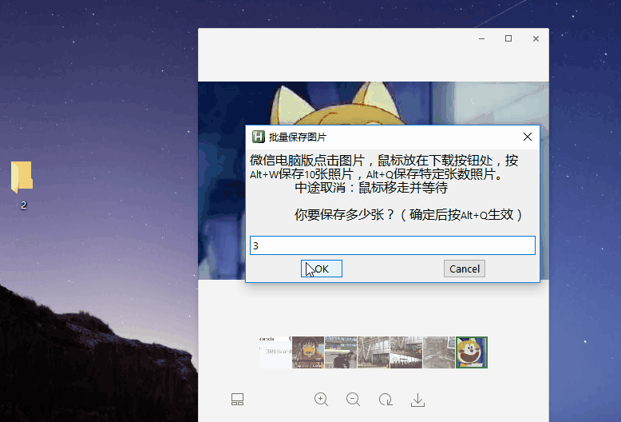

# BatchSaveWechatPicture
微信电脑版（Windows）批量保存微信图片原图，AutoHotkey 脚本实现。

## 使用方法

- 运行[exe脚本（点Raw下载到本地）](./batchSaveWechatPicture.exe)，输入数量后，在微信电脑版上点击图片，鼠标放在下载按钮处，按 `Alt+Q` ，然后不操作电脑等脚本自动保存就行。
- 另外内置保存10张的按键：`Alt+W` 保存10张，固定数目，留给 `Q` 键不可用用户。

## License

**The MIT License**